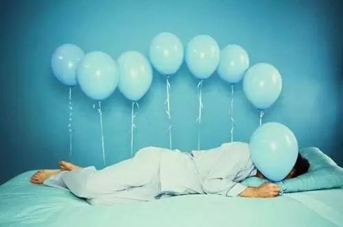

几乎每个人对失眠都存在严重的误解。

在大家的感觉中，失眠是慢性疾病，不停的折磨自己。当失去睡眠能力的时候，我们会惊慌失措，会焦虑担忧，会找各种各样的办法希望重新睡个好觉。抱怨、求医、泡脚、按摩、早早上床……卧床的辗转反侧，睁着眼到天亮的绝望，失去睡眠的痛苦，无法好好生活的白天，被情绪支配的日子。这些情况几乎发生在每个失眠者的身上。

能睡个好觉，似乎成了很多人的愿望。

现在，换个角度考虑。**任何人在任何时候都可能会失眠**。当我们遭遇压力、疾病、分离、伤痛、失业等等突发事件的时候，自己生活的平衡会被打破，失眠也会随之出现。这些突如其来的变动会发生在每个人的生活中，所以失眠也会伴随每个人一生反复不断的出现（更具体的解释请回复「为什么失眠」）。

用客观理性的态度看待失眠会给我们带来最正确的见解：

失眠只是我们当前身体和精神状态的自然反应，它是一件平常事。

在漫长的一生中，每个人都会经历起起伏伏。当我们工作顺利、生活健康，身心处于均衡的状态，睡眠很少出现问题。然而事情并非永远一帆风顺，人生苦乐参半，一个人总会遇到各种各样的麻烦和苦恼，当身心处于低谷，失眠就会出现。

所以说失眠只是一个信号、一个表象、一个结果。如果把它当做造成一切痛苦的源头，付诸许多努力去摆脱失眠，反而会让自己失去更多，也会更深的陷入失眠（回复「培育」阅读更详细解释）。我们要把它当做一件平常事：晚上睡不好而已，生活还应该继续，我们要努力去解决生活和工作中的实际问题和麻烦。

通过这样的方式去思考失眠，让我们把对待失眠的态度从疾病转变为生活中的一个平常烦恼。为了解决这个烦恼，我们需要了解造成失眠背后的原因，并主动解决自身存在的问题。下面几篇文章会帮助你思考并给出具体的解决方案。

回复「培育」阅读『被我们精心培育的失眠』

回复「无为而治」阅读『面对失眠应该无为而治』

回复「当下的河流」阅读『沉浸在当下的河流中』

回复「活着」阅读『真的感受到活着 才能真的睡着』

有必要强调：睡吧有很多文章，这些文章并不是让大家阅读的，而是需要按照其中的意见行动。没有行动就没有正面能量的发生，也不可能对自己的想法和认识产生任何好的影响。我们必须通过行动把自己拉出泥潭。
