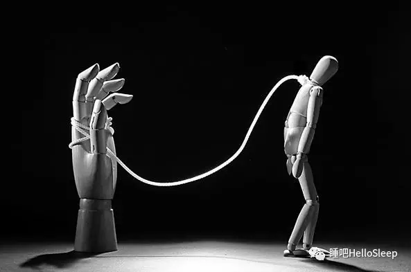
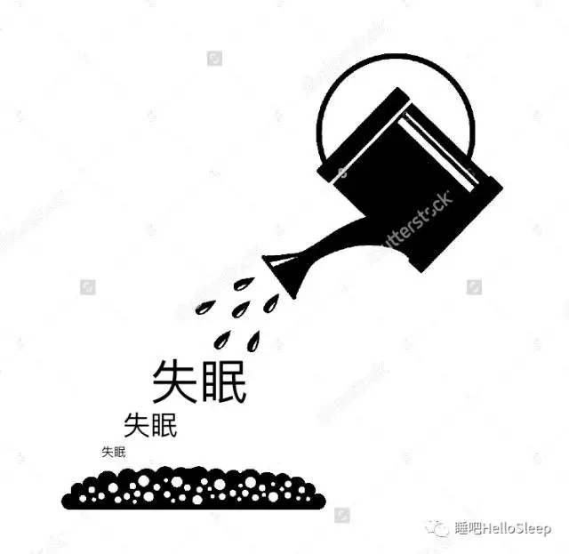

> 随使使者，即随使者死。-- 《杂阿含经卷第一（一五）》

这段来自于阿含经的话，意思是这样的：**如果我们被烦恼所左右，就会随着烦恼进入恶性循环**。失眠就是这样一个简单的烦恼，失眠者非常容易被它牵着走。

## 从短期失眠到慢性失眠

在『[失眠是个平常事](/docs/shi-mian-shi-ge-ping-chang-shi/)』这篇文章我们提到：**任何人在遭遇生活巨大变动的时候都会产生短期失眠，这只是我们身心的自然反应**。比如：重要的考试，重要的比赛，人生的大事件，极度非常或者极度兴奋的夜晚，都偶尔会陷入短期失眠，这些非常正常。然而恰恰是失眠后不正确的应对，导致我们从短期失眠陷入长期的慢性失眠。

可以想象，失眠就像是一根柱子，而失眠所带来的焦虑和担忧就像是一根绳子，这根绳子一端绑在柱子上，一端套在脖子上，我们就这样被栓住，每天都在围绕失眠转圈。**一方面为失眠做各种各样的努力，另一方面也为失眠放弃了许多自己的责任**。逐渐，我们陷入慢性失眠。

在睡吧的咨询中，最为常见的状况是，一旦我们开始被失眠所驱使，就会失去正常的生活。

- 为了解决失眠而选择白天躺在床上“补觉”……
- 为了解决失眠开始选择提前四五个小时提前上床准备着……
- 为了解决失眠开始喝牛奶，泡脚，听音乐……
- 为了解决失眠不停咨询医生，寻医问药，拒绝社交，甚至拒绝和朋友聚会……

当我们对失眠越发的恐惧和焦虑，也就被这根绳子套的越牢，我们会在失眠中陷得越深。

回过头再看本文开始，大概也就能理解那句经文的含义：**被烦恼所左右，就会随之进入恶性循环**。

## 精心的培育

事实上，刚刚出现失眠的时候，如果不去理会它，如果可以不被失眠所左右、不刻意的通过各种方法对治失眠、不抱怨……，只是和从前一样正常的生活、学习或工作，那么睡眠就能很快恢复正常。

然而，一旦开始为失眠做出各种各样的努力，开始被它左右，逐渐我们的整个生活都会绕着失眠转圈，睡眠就会越来越糟，生活也会变得一塌糊涂。 

也就是说，**失眠并不是病，而是被我们的言行精心培育出来的结果**。

[ 注意，是我们的**言行**在培育失眠，而不是想法与情绪。然而大多数失眠的人过于纠缠于自己的想法和情绪，却不知只有言行才会导致好与不好的结果。]

## 反省自己的言行

失眠是一个信号，它让我们必须反省自己与当前的生活状态。试着反省一下自己，自己不知不觉做了哪些言行在悄悄得培育失眠：

- 是不是试图多睡一会儿、白天补觉或者在学习工作的时候休息？ 
- 是不是总向别人哭诉和抱怨？ 
- 是不是在网上搜索各种信息，或者向各种人求助？ 
- 是不是试图少做一些工作、少学一点，或者干脆辞去了工作、放弃学业？ 
- 是不是去看医生，吃安眠药或者抗抑郁的药物？ 
- 是不是开始变得不爱和人交流，不爱运动，或者失去了某些做事情的活力？ 
- 是不是变得很少去考虑周围亲人或朋友的近况？ 
- …… 

如果这些是你现在的状态，那么说明整个生活正在被失眠所左右。这些事情发生的越多，对睡眠的期待就越强烈，失眠就会越发顽固。

反省并理解是哪些所作所为导致了失眠，是走出失眠的第一步。

 

