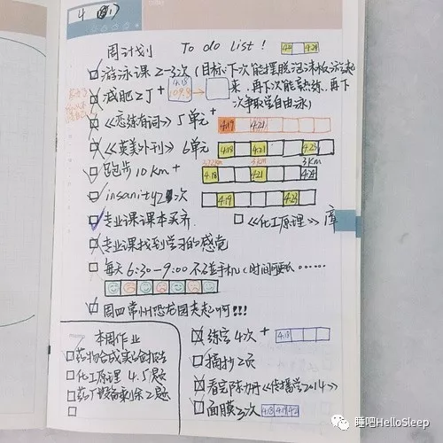
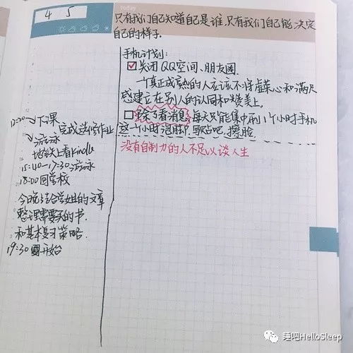
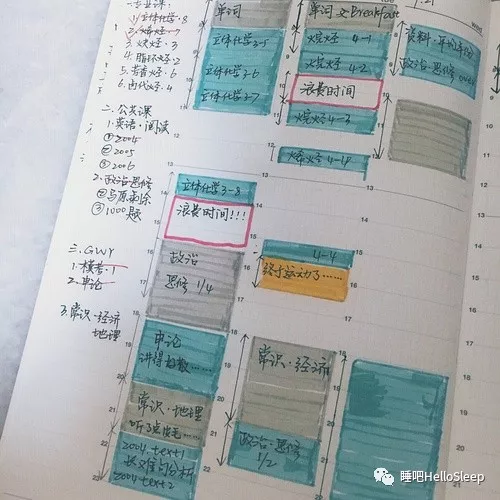

这篇文章我很早就想写，从最开始的不知如何下笔到后来电脑软件坏损，好像阻挠重重，但真正让我下定决心写的是那些陆陆续续向我豆油的朋友们，看到他们还在失眠的沼泽里苦苦挣扎，我在想我还能做些什么，我应该做些什么。

从小伙伴们问我的问题，不难看出，他们是在豆瓣睡吧反复看了很多文章，并且对理论牢记于心了。举个例子，当我问“你知道自己要做什么了吗？”对方回答：“知道！活在当下！”

没错，“活在当下”、“不抗拒焦虑”、“把握清醒的时间”，都是绝对正确的，但是把理论牢记于心就行了吗？显然是不够的。所以，今天我想从实际出发，具体说说在我从失眠走向正常生活期间该如何做，如何想。

## Part1 养成良好的生活习惯，重回正常轨道

### 1、让日记本成为你规划、记录生活的好帮手（很重要！！！）

失眠的人往往生活重心已经跑偏了，你是否无心学习，无心工作，无心融入集体，一心只想寻找入睡方法？

这时候就需要严格的自我约束，所以准备一本属于你自己记录的本子是很有必要的！从失眠那会儿养成记录的习惯让我收获了一个积极向上的自己，对我来说受益良多~我真的非常推荐大家都这样做。

日记本上分为几部分：

1. 每日必做（to do list），把自己的学习、工作、家庭计划好好地规划，最好把具体的时间也安排好。在井井有条的生活中，你重新爱上那个为目标积极努力的自己，每天晚上带着满足入眠。
2. 每日反思，失眠的人总是觉得自己是全世界最不幸的人，所以一味地向周围的人抱怨，这样不仅让周围的人很疲惫，而且也不利于你自己的成长。我们为什么不把失眠当做一次发现自己问题、改变自己的机会呢？所以不妨写写今天你又有哪些做的不好的地方，比如因为失眠赖床了、不想工作了、向周围人发脾气了等等。
3. 表扬自己，说完了自己做的不好的，当然也有值得表扬自己的地方啊。比如，尽管我昨天睡得不好但我今天还是表现得很好；我比之前进步了巴拉巴拉（去发现自己的闪光点吧！）

小女子献丑几张以前的记录～

周计划

日计划

时间规划更精确，更严格的日计划

我知道有很多玩手帐的朋友喜欢花很多钱和精力在本子，笔和装饰上面。但是我的初衷是改变自己，所以我觉得字好不好看不重要，用什么本子和笔也不重要，重要的是我们的态度，一颗想要『每天收获更好的自己』的态度～

### 2、定闹钟，跟赖床say no

已经睡好了，但还想在床上多待会儿看看能不能再多睡点；头天没睡好，非得较劲赖床……无论如何，当你有了贪念的时候，就要把它扼杀在你的被窝里，不管睡得如何，都要按时起床！

### 3、去培养兴趣爱好吧

谁说失眠的人的生活就是黑色的？只要我们想，生活依旧是丰富多彩、缤纷灿烂的。去健身吧、去学画画吧、去跳舞吧……生活不只有失眠，还有诗和远方。相信我，当你真的发自内心地热爱生活的时候，生活也会热烈地拥抱你。

失眠那会儿我学会了游泳🏊，我还通过运动减重了10斤，爱上了在操场上挥洒汗水的自己。

### 4、试着挑战自己吧

太多太多人，因为失眠，放弃了或者想放弃学业、爱情、工作，想换一份轻松的工作，不敢考研，甚至害怕未来。

我记得我失眠的时候，尝试着参加了学院的一个微电影大赛，最后得了第一名。当时觉得自己好了不起，不是说这个奖有什么值得骄傲的地方，只是发自内心地谢谢自己没有放弃内心的追求。当你去尝试一些事情的时候，你会发现是你自己把失眠想的太可怕，其实你跟正常人没什么两样，你也有资格去追求属于你的梦想，属于你的幸福人生。

## Part2 及时转变思维，避免被情绪掌控。

当你被失眠带来的各种情绪左右时，你自己就是自己最好的朋友，最好的心理医生。如果你也有以下情况，或者你下次遇到这些，不妨转变思维，耐心地安抚自己。

### 1、恐惧焦虑突然来袭，怎么办？

告诉自己：恐惧、焦虑啊，你们来到我心里了，没关系，我知道你们是来保护我的，来了就坐会儿再走吧。

### 2、因为失眠，我到底应不应该休学或辞职？（分手、不带孩子、换份轻松的工作……）

不应该。这时候就想想，如果这件事在我没有失眠的曾经，我会怎么做？我会做出什么选择？然后就按照那个去做。

### 3、昨天晚上突然又睡不好了，好痛苦怎么办？

睡眠其实就是一种生理现象，生病了好了它也可能会再生病，便秘也时有发生，那你怎么能要求睡眠必须时时完美呢？

### 4、失眠真的会好吗？我怕我接下来的生活都要与失眠作伴。

失眠从未有痊愈之说，你会有这样的害怕来源于你的执着与贪念。就拿我自己来说吧，我现在还是偶尔会入睡困难，焦虑紧张的时候也会睡不好，但是我丝毫没觉得这是个事儿，打心眼里觉得没关系。什么时候不执着了，其实也就不存在失眠了。

### 5、我怕失眠让我长痘痘，脸色不好看，变老变丑，生病……

我们的长相，不单单是五官的堆砌，而是一种感觉、一种气质，它不会因为你哪里长了一颗痘痘、有点黑眼圈就改变。何况那些明星的睡眠时间有很少啊，他们也是神采奕奕的，既然睡眠不好，那就加强运动，女孩子敷个面膜保养一下，在能使劲儿的方面努力嘛~

### 6、我知道我不该这样成天被失眠左右，但是我还是忍不住想，我讨厌现在的自己。

告诉自己，你已经很好了，你已经努力在生活了。

最后，我非常非常喜欢一句话：尽人事，听天命。这句话可以解决百分之八十的烦恼，尽力睡了还是睡不着，那我别怪自己了，起来吧。尽力生活了还是焦虑，那就焦虑吧，我继续保持。只要尽力了就别怪自己了。

