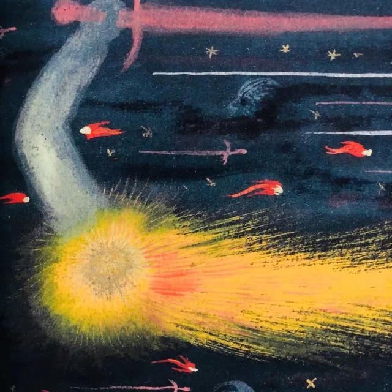
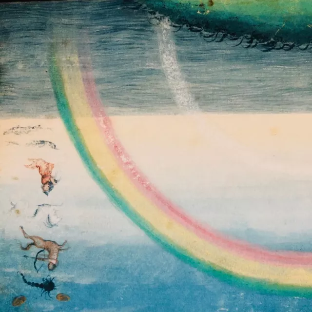

各位朋友们，大家好！

几个月前，我第一次接触睡吧，看了几篇文章以后，安然入睡了一个月，就以为自己痊愈了，还美滋滋地发表了一篇小感。

后来，经历了几次痛不欲生的反复，我才知道那个时候我并没有真正领悟到什么是痊愈。

而我现~在也并不知道我是不是痊愈，我不知道我下一次反复是什么时候，我只知道，我变得更加强大了。

所以我想跟大家分享一下我的经历。

首先说我自己，我是一个爱美的女生，所以任何能让自己变美的方法我都原因尝试，“美容觉”这个词大家都不陌生，所以我觉得让我失眠的是我对睡眠的执着于贪念！明明之前睡眠习惯很好了，每天睡8小时还嫌不够，羡慕那些每天睡十几个小时的人。恨不得有空就赖在床上睡，随时随地睡，每次下午睡个三个小时醒，皮肤通透明亮，自己也浑身舒服，那感觉真是美滋滋～对吧，失眠前的你们也拥有这样平凡的幸福吧！甚至也跟我一样对睡眠执着，对外表执着，对健康执着吧。   从小到大，我们都习惯了，成绩不好，那就努力学习去赶超，胖了丑了那就运动控制食量减肥，能力不足就多补知识，还从来没有遇到一个东西是不能靠我们努力得来的，偏偏……这个睡觉，越努力越事与愿违，越执着它离得越远。你是不是也这样想过，我情愿得个可以治疗的疾病，比如阑尾炎我就去割了，肿瘤我就去切了，感冒我就吃药……最怕的就是这失眠，真是无解啊！

### 关于接受

刚开始失眠的时候，我想每一个人都不能接受：我还这么年轻，我不想得这种病，我到底做错了什么，我这么善良的人，为什么老天爷要夺走我的幸福？

于是，这个时候，我们会疯狂地在网上寻找各种解决办法，我们甚至愿意不惜一切代价去换回原来的睡眠。

我记得有人曾经跟我说，吃喝拉撒睡是贯穿我们的一生，总会有出问题的时候，比如你吃的东西极端了，那么久会便秘，而失眠以及它带来的消极情绪就是你思想的极端。

所以，放弃吧，这个世界上绝对不存在任何一种方法和解药，能够保证你夜夜安睡。什么呼吸法，什么数数法，什么闭眼法，喝牛奶，泡脚，运动……这些都没有任何的作用！

### 不要为失眠放弃任何事情

我做过最愚蠢的事情就是因为失眠放弃了我的爱情。大家都知道，失眠的时候，成天就是想着怎样才能好，怎样才能睡着，每天大脑里涌现出各种担心害怕。那段时候我感觉我变了一个人，所以我想着，“等我失眠好了，我才有资格谈恋爱。”现在想想这是多么愚蠢的想法……所以，“等我失眠好了，我就去……”这样的想法是错误的，因为，你根本不知道自己什么时候会好，怎样才算好了，失眠不会一夜之间就变好。你要做的就是，即使我失眠，我也可以好好地工作，好好地爱别人。可能你会说，我失眠我精神不好啊，我头昏眼花，我心里老是涌现出奇奇怪怪的担心，我没法像从前一样集中精力去做好事情，这该怎么办啊？的确，这真的很难。这个时候，就需要你坚强，即使是效率不如从前，但是不要放弃，就这样难受地撑着，去做你该做的事情。慢慢地，你就会发现，即使我失眠，我还是可以做好一件事。 

### 关于反复

反复真的是非常非常正常的。不要每次一反复就怀疑自己，怀疑今后，这个时候，你要做的不是疯狂地抱怨或者继续寻找方法。你要做的就是安忍，忍者痛苦，继续好好地生活。每一次的反复，都是一次历练，你会在一次一次的反复中变得更好，只要你在正确的路上。

### 关于抑郁

大家可能在失眠的时候，出现任何一种情绪问题都会联想起自己是不是抑郁症或者强迫症或者焦虑症。很正常，我也很害怕自己会因为抑郁症完蛋，我去学校心理咨询中心，一遍一遍地问老师：“老师，我这不是抑郁症吧？”其实，后来我才发现，这就是抑郁，每天轻生的念头都像脱缰的野马一样在我的脑海里冲撞，我每天问自己到底怎么了？在失眠的时候，会有好多的情绪问题滋生，你会陷入没日没夜的担心，对晚上是否能睡着的担心，对未来的担心，感觉一切都没有希望，没有意义了。这些我都经历过，都理解。从现在开始，担心就担心，痛苦就痛苦，就带着这些情绪，把该做的做好。抑郁就是这么一回事，不要害怕它。还有，不要轻生，这一切都可以通过自己的力量改变的，你要相信自己真的有这种力量的。

### 关于担心害怕

就在昨天晚上，我脑海里还突然闪过这个念头：我今天晚上会不会睡不着啊？换做以往，我肯定会因为这个念头紧张，“完蛋了完蛋了，又开始担心了，那肯定睡不着了啊，你说你干嘛要担心啊，你不担心不就可以睡着了吗？……”可是，昨天，我就只是闪过了这个念头而已，然后告诉自己，没有办法，担心害怕也没办法，即使睡不着也没办法，我已经做好了睡不着的准备，睡不着明天我也得好好过。所以说，担心很正常，害怕很正常，你不要因为出现了这种想法就责怪自己，也不要因为出现了这种想法就不知所措，让它在你的心里停留。你没有任何办法去控制自己的想法和情绪，你能做的，只有把握你清醒的时间！

### 关于抱怨

我觉得没有体验过失眠的人是无论如何都不能懂这种感受的，哪怕的你最好的朋友，甚至是你的父母。所以，停止你对他人的抱怨，抱怨并没有什么卵用，失眠的时候，要安忍，像平常一样做自己的事情。

### 什么是活在当下

组长说“活在当下”，一开始我并不理解。其实活在当下并不是说要你把自己弄得很累很忙很拼命。举个简单的例子，出去玩的时候，就好好地欣赏一下风景，然后拿起相机记录一下或者帮你的小伙伴拍个照片。活在当下就是用心地体会你每分每秒在做的事情，不要敷衍，我知道对于一个失眠的人来说很难，确实，但是要努力不是吗？你要比平常付出更多的努力去好好生活。

### 关于改变

你可能觉得自己是一个很善良的人，你觉得全天下就你最不幸了，让你失眠。但是你静下来从大方面好好想想，生活中你是不是一个自私的人，是不是一个嫉妒心很强的人，是不是拖延症患者，是不是做事三分钟热度，是不是行动力不足……从小的方面想，今天你是不是又懒懒散散地玩了一天手机，你是不是又对父母不耐烦，是不是又对身边的人心生讨厌乱嚼舌根……今天你有没有发自内心地感恩？感恩身边的朋友都这么体贴善良，感恩陌生人的小小善意……单单看文章，可能会起到短暂的效果，但是想要变好，不行动，不改变自己是绝对不行的。在你的心性得不到大的改变之前，你的失眠是不会好的。所以，就当失眠是派来改变你的吧！

最后，我想鼓励大家也鼓励我自己，谢谢自己这么勇敢坚强，承受着这个年纪不该有的压力和美貌 哈哈。要记住，那些杀不死你的，只会让你更强大啊！这个世界能够治愈你的只有你自己。最后说一声，谢谢组长，谢谢西撒，谢谢simple，谢谢每一个还没放弃自己的人，我也不知道什么是痊愈，我只知道，我们都会越来越好。

编者按：

今天的配图是400年前，人们脑海中想象的星辰宇宙.

在2018.2.6日，Space X重型猎鹰火箭载着马斯克红色的特斯拉跑车一同被成功送入太空。跑车背景音乐无限循环着大卫·鲍伊的《Space Oddity》，而车内屏幕上赫然亮着一行字“Don't Panic”。

用《奇迹之书》纪念这个时刻。

希望每一个来过睡吧，经历过失眠的人，在失眠的漫长道路上，能发现一个个电光火石的瞬间，亦能一起感受奇迹时刻。

